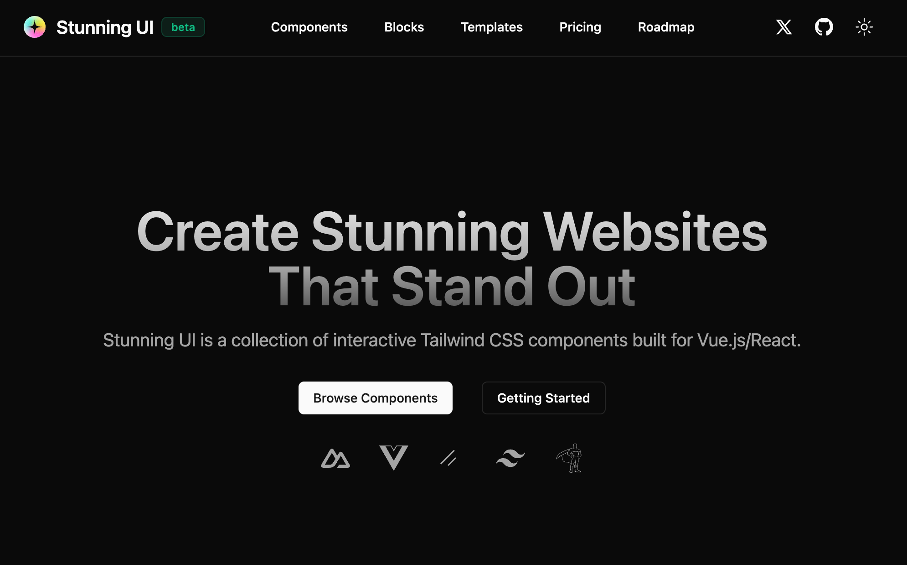

# Stunning UI

> Create Stunning Websites That Stand Out. Stunning UI is a collection of interactive Tailwind CSS components built for Vue and Nuxt.

## Preview



## Features

- Components - 30+ free open-source components that you can copy and paste into your next project.
- Blocks - Segmented and customizable blocks for creating various types of website pages.
- Templates - Pre-made, ready to use templates for startups and small businesses.

## Setup

### Installation

Make sure to install the dependencies

```bash
pnpm install
```

### Development

Start the development server on http://localhost:6636

```bash
pnpm dev
```

### Production

Build the application for production:

```bash
pnpm build
```

## Tech Stack

- GSAP - For animations
- Vue 3 - For the framework
- Nuxt 3 - For the framework
- Tailwind CSS - For the styles
- Shadcn Vue - For the UI
- VueUse - For the utilities
- Vite - For the build

## Contributing

See [CONTRIBUTING.md](./CONTRIBUTING.md) and please follow our [Code of Conduct](./CODE_OF_CONDUCT.md).

## License

MIT [@xiaoluoboding](https://github.com/xiaoluoboding)
